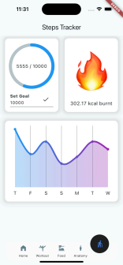

# GymGenie

## Table of Contents
- [Overview](#overview)
- [Features](#features)
  - [Workout Tracker](#workout-tracker)
  - [Nutrition Log](#nutrition-log)
  - [Stepometer](#stepometer)
  - [Interactive Anatomy](#interactive-anatomy)
- [Tech Stack](#tech-stack)

## Overview 🏋️

GymGenie is an all-in-one fitness application that empowers health enthusiasts and gym-goers alike to achieve their fitness goals through comprehensive tracking, personalised recommendations and educational resources

## Features

### **Workout Tracker** 📊
A user-friendly platform designed to help users seamlessly log their workouts and track progress. The platform enables personalisation by allowing users to record key details such as target muscle groups, weights, repetitions, and more. Whether you're a beginner or a seasoned athlete, this tool empowers you to stay organised and focused on achieving your fitness goals.

### **Nutrition Log** 🥗
The Nutrition Log helps users effortlessly track their meals throughout the day, providing a clear and informative overview of their caloric intake. A detailed macro-nutrient breakdown is displayed graphically, helping users stay mindful of their dietary balance. Whether aiming for specific nutritional goals or simply staying on top of their diet, this feature makes it easy to monitor and adjust food intake.

### **Stepometer** 👟

The Steps Tracker leverages on the HealthKit API to record the number of steps taken each day, providing real-time data and insights into historical trends. By seamlessly integrating into users’ routines, this feature enables them to align their workouts and nutritional intake with the calories burned throughout the day, helping to optimise their fitness goals and achieve long-term health improvements.

### **Interactive Anatomy** 🫁
The Interactive Anatomy feature offers a detailed, visually engaging guide to human anatomy, designed specifically for fitness enthusiasts and gym-goers. Users can explore various muscle groups by clicking on different areas of the body. This presents users with a curated list of exercises, complete with clear instructions to promote proper form and technique.

## Tech Stack 💻
- Flutter
- SupaBase
- Figma
- HealthKit API
- TestFlight
- Github

